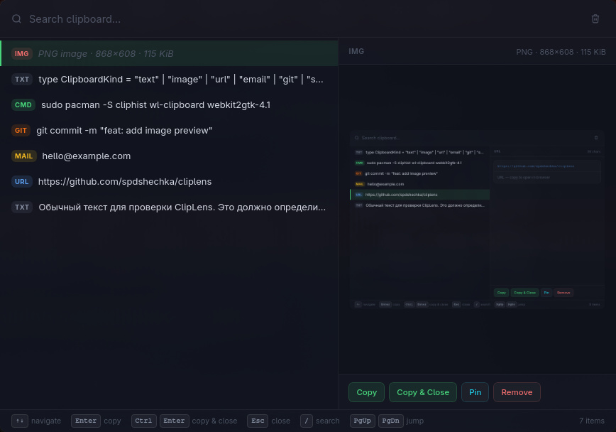

# ClipLens

**A beautiful clipboard picker for Hyprland.**

ClipLens is a keyboard-first clipboard popup that sits on top of [cliphist](https://github.com/sentriz/cliphist). Press a key, search your history, copy and go. It is not a clipboard daemon — cliphist handles storage, ClipLens handles everything you see.

> Built for Arch Linux + Hyprland. Not cross-platform.

## Screenshot




## Features

- Dark glass UI — no window decorations, rounded panel, accent glow
- Keyboard-first — navigate, search, copy, and close without touching the mouse
- Full-text search across clipboard history
- Content-aware type badges — URL, email, shell command, git, code, image
- Image preview — decodes and renders PNG / JPEG / WEBP / GIF inline
- Pinned items — persist across restarts, always shown at the top
- Clear history — wipes cliphist database with confirmation
- Graceful error states — works in browse-only mode if `wl-copy` is missing

## Requirements

**Runtime:**

- Hyprland (or any Wayland compositor)
- [`cliphist`](https://github.com/sentriz/cliphist)
- [`wl-clipboard`](https://github.com/bugaevc/wl-clipboard)

**Build:**

- Rust (stable)
- Node.js 18+
- Tauri v2 system dependencies

Install everything on Arch:

```sh
sudo pacman -S cliphist wl-clipboard webkit2gtk-4.1 base-devel curl wget file openssl appmenu-gtk-module librsvg
```

## Setup

**1. Start cliphist daemon**

Add to `~/.config/hypr/hyprland.conf`:

```
exec-once = wl-paste --watch cliphist store
```

**2. Clone and build**

```sh
git clone https://github.com/yourname/cliplens ~/projects/cliplens
cd ~/projects/cliplens
npm install
npm run tauri build
```

The binary will be at `src-tauri/target/release/cliplens`.

**3. Bind to a key in Hyprland**

```
bind = SUPER, V, exec, /path/to/cliplens

windowrulev2 = float,        class:(ClipLens)
windowrulev2 = center,       class:(ClipLens)
windowrulev2 = size 820 560, class:(ClipLens)
windowrulev2 = noanim,       class:(ClipLens)
windowrulev2 = stayfocused,  class:(ClipLens)
```

> Run `hyprctl clients` while ClipLens is open to confirm the exact `class` and `title` values on your system.

**Optional — compositor blur**

ClipLens uses an opaque window by default (transparent Tauri windows trigger a Wayland protocol error on some setups). The glass effect is CSS-only. To add blur behind the window:

```
windowrulev2 = opacity 0.92 0.92, class:(ClipLens)
layerrule = blur, class:(ClipLens)
```

## Development

```sh
npm install
WEBKIT_DISABLE_DMABUF_RENDERER=1 npm run tauri dev
```

> `WEBKIT_DISABLE_DMABUF_RENDERER=1` prevents a WebKit/DMA-BUF crash that affects some GPU drivers on Wayland. Set it in your shell config if you hit a blank window or crash on startup.

## Keyboard shortcuts

| Key | Action |
|---|---|
| `↑` `↓` | Navigate list |
| `PgUp` `PgDn` | Jump 6 items |
| `Home` `End` | First / last item |
| `Enter` | Copy selected |
| `Ctrl+Enter` | Copy and close |
| `Esc` | Close |
| `/` | Focus search |

## Architecture

| Layer | Technology |
|---|---|
| Window shell | Tauri v2 |
| Frontend | SvelteKit + Svelte 5 + TypeScript |
| Styles | Tailwind CSS v3 + CSS custom properties |
| Clipboard backend | cliphist (external, not bundled) |
| Copy | wl-copy (from wl-clipboard) |
| Rust commands | `list_clipboard_items`, `copy_clipboard_item`, `preview_image_item`, `clear_clipboard_history`, `check_dependencies` |

ClipLens never modifies cliphist data except when you explicitly click **Clear History**.

## Roadmap

- [ ] Themes
